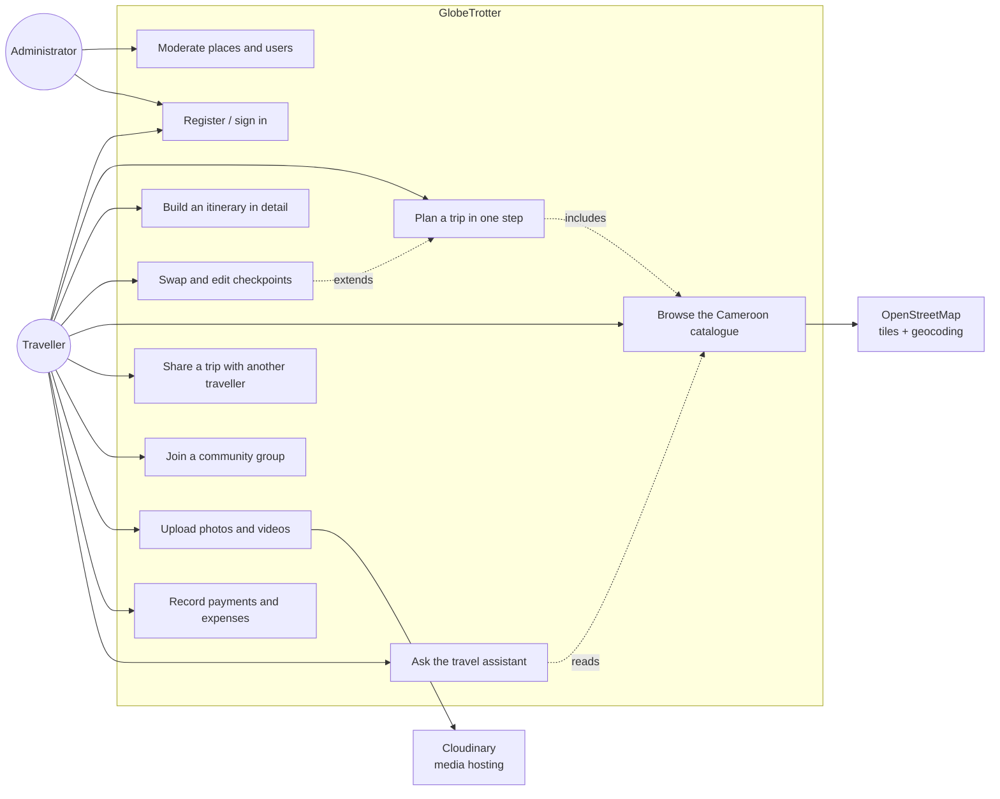
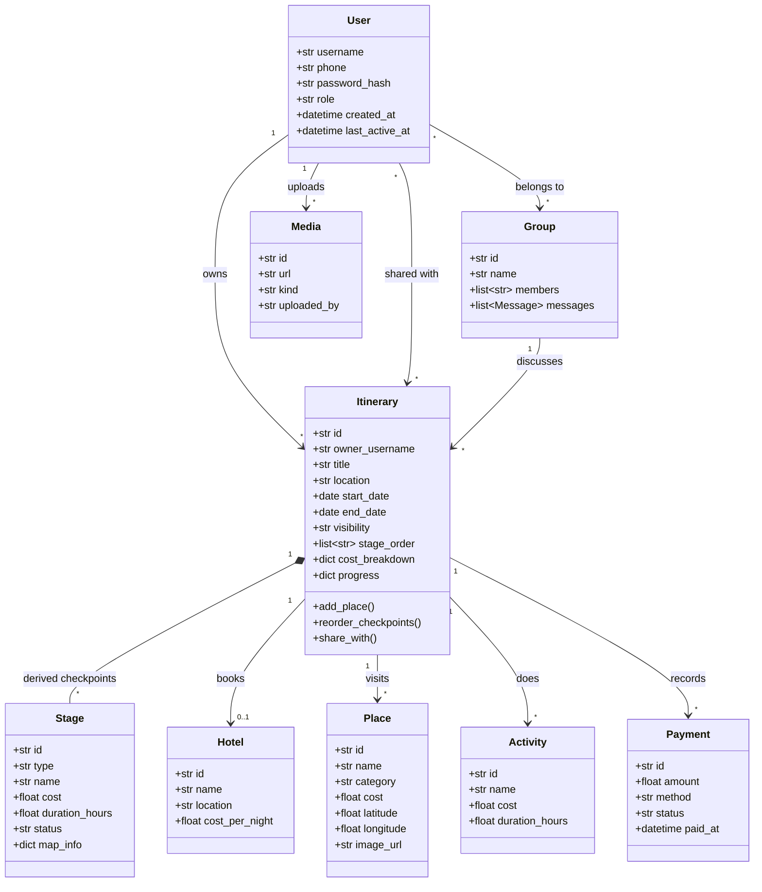
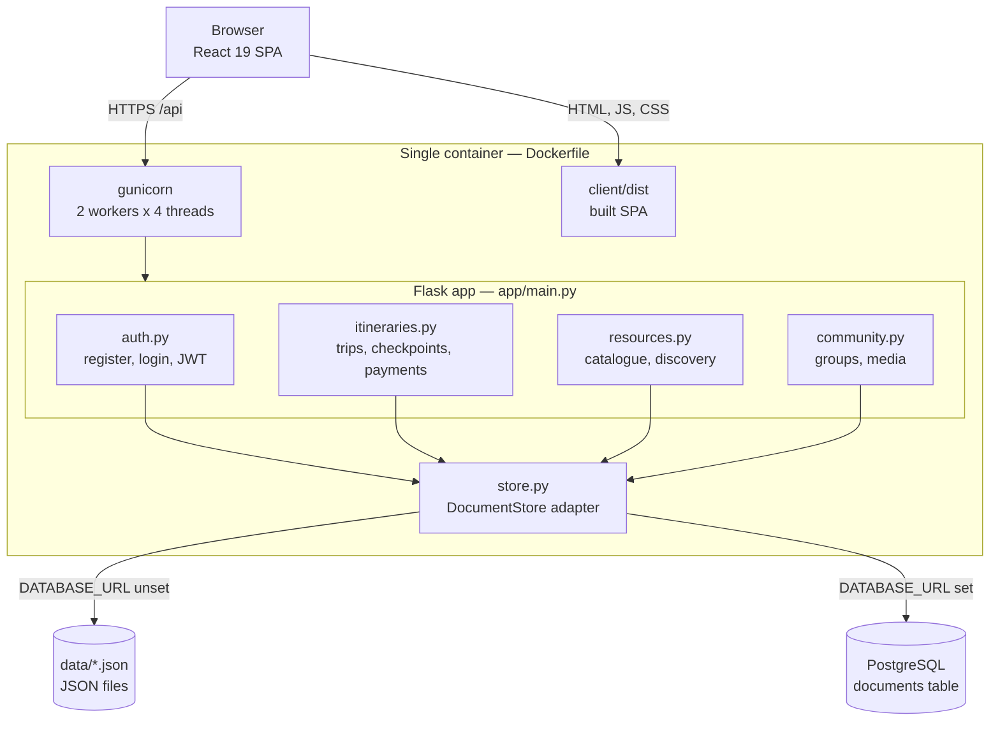
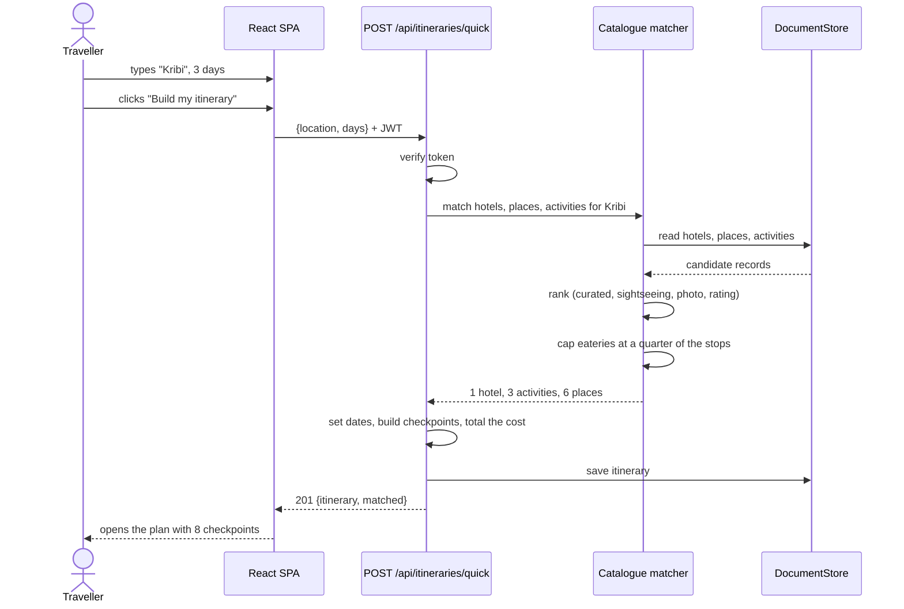
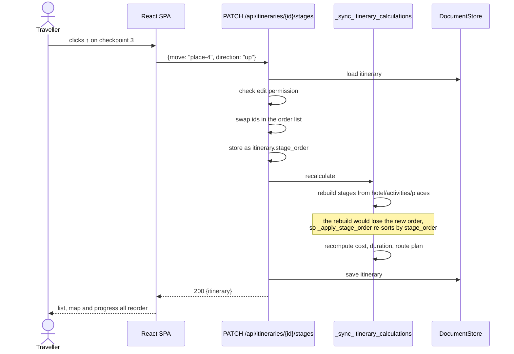
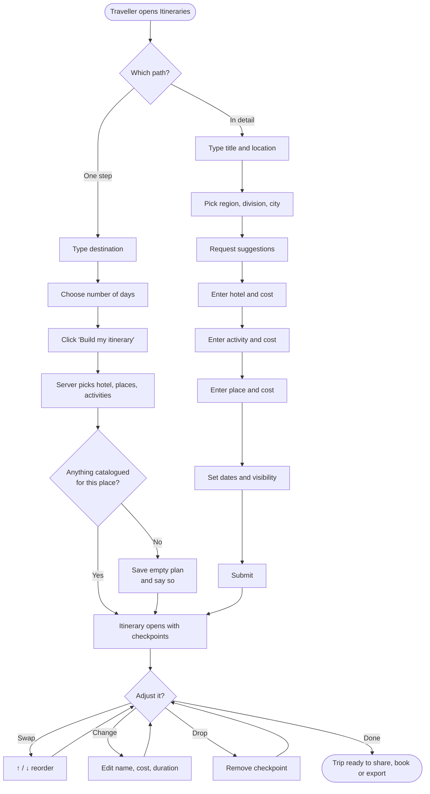
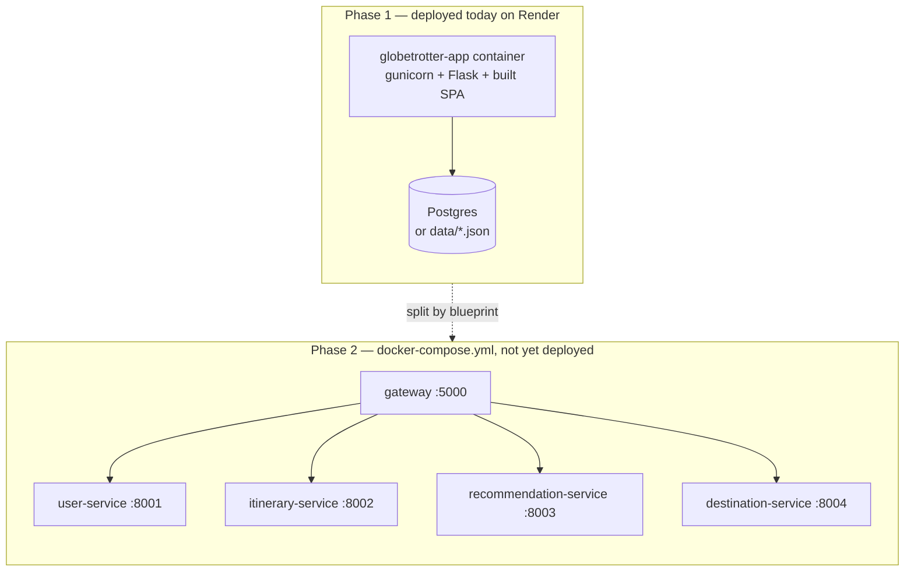

# UML design

Diagrams for GlobeTrotter. They are written in Mermaid, so GitHub renders them
directly on this page — nothing needs to be installed to read them.

Each diagram names the files it describes, so a claim here can be checked
against the code.

---

## 1. Use case diagram

Who uses the system and what they can do.

---

## 2. Class diagram

The domain objects and how they relate. `Itinerary` is the centre of the model:
everything else either belongs to one or is referenced by one.

**Note on `Stage`.** A stage is a *derived* object, not a stored one. It is
rebuilt from the itinerary's hotel, activities and places on every save by
`_build_stage_plan()` in [app/itineraries.py](../app/itineraries.py). That is why
the traveller's chosen order has to be persisted separately, as `stage_order` —
see the sequence diagram in section 4.

---

## 3. Component diagram

How the running system is put together today (Phase 1, one container).

---

## 4. Sequence diagram — planning a trip in one step

The short path, added because the detailed form took too long to complete
during a live demonstration.

---

## 5. Sequence diagram — swapping a checkpoint

Shows why the order must be stored rather than simply reordered in place.

---

## 6. Activity diagram — creating an itinerary

Both paths through the feature, side by side.

---

## 7. Deployment diagram

What runs where today, and what Phase 2 changes.

---

## Where each diagram comes from

| Diagram | Code it describes |
| --- | --- |
| Use case | [app/auth.py](../app/auth.py), [app/itineraries.py](../app/itineraries.py), [app/community.py](../app/community.py), [app/admin.py](../app/admin.py), [app/assistant.py](../app/assistant.py) |
| Class | [app/models.py](../app/models.py), `_build_stage_plan()` in [app/itineraries.py](../app/itineraries.py) |
| Component | [app/main.py](../app/main.py), [app/store.py](../app/store.py), [Dockerfile](../Dockerfile) |
| Quick-plan sequence | `create_quick_itinerary()` in [app/itineraries.py](../app/itineraries.py) |
| Checkpoint sequence | `reorder_itinerary_stages()` and `_apply_stage_order()` in [app/itineraries.py](../app/itineraries.py) |
| Activity | `handleQuickPlan()` and `handleCreateItinerary()` in [client/src/App.jsx](../client/src/App.jsx) |
| Deployment | [Dockerfile](../Dockerfile), [docker-compose.yml](../docker-compose.yml), [services/](../services/) |
